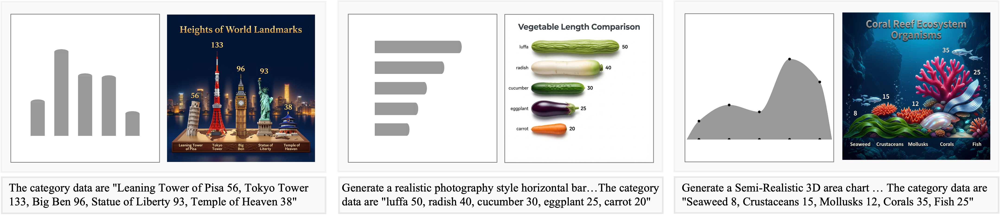
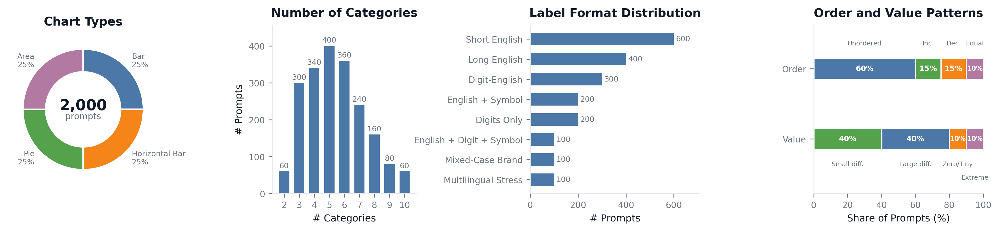

# ArtChart: Faithful Artistic Chart Generation with Integrated Text Rendering

[Paper](https://arxiv.org/pdf/2607.16060) | [arXiv](https://arxiv.org/abs/2607.16060) | [ArtChart_Bench](https://huggingface.co/datasets/inclusionAI/ArtChart_Bench)

<p align="center">
  
</p>

Official repository for **ArtChart**, a benchmark, inference pipeline, and evaluation suite for faithful artistic chart generation with integrated text rendering.

ArtChart studies artistic chart images that preserve chart geometry, render chart text accurately, bind labels to the correct marks, and maintain visual appeal.

<p align="center">
  
</p>

## Release Status

| Component | Status |
| --- | --- |
| ArtChart-Bench metadata | Available |
| ArtChart-Eval | Available |
| Inference code | Available |
| Model weights | Coming soon |

Supported chart types are `bar`, `hbar`, `pie`, and `area`.

## Installation

```bash
conda create -n artchart python=3.10 -y
conda activate artchart
pip install -r ArtChart_Eval/requirements.txt
```

For inference, use a PyTorch/Diffusers environment compatible with Qwen-Image and ControlNet.

## Benchmark Preparation

Generate grayscale control images and prompts from the released benchmark metadata:

```bash
python ArtChart_Bench/generate_gray_from_json.py \
  --json-path ArtChart_Bench/ArtBench-200.json \
  --output-dir data/ArtBench-200
```

The generated benchmark directory follows:

```text
data/ArtBench-200/<chart_type>/<sample_id>/
  gray.png
  prompt.txt
```

Use `ArtChart_Bench/ArtBench-2k.json` for the full benchmark.

## Benchmark Inference

```bash
python ArtChart_Gen/generate_bench_artchart.py \
  --artchart_bench_dir data/ArtBench-200 \
  --output_dir outputs/artchart \
  --base_model_path /path/to/qwen-image \
  --artchart_controlnet_path /path/to/artchart-controlnet \
  --lightning_lora_path /path/to/lightning-lora \
  --grpo_lora_path /path/to/artchart-grpo-lora \
  --chart_types bar hbar pie area
```

The ArtChart model weights are coming soon.

## Evaluation

Build the evaluation JSONL:

```bash
python ArtChart_Eval/gen_eval_jsonl.py \
  --artchart-dir outputs/artchart \
  --eval-data-dir data/ArtBench-200 \
  --output-jsonl-dir outputs/eval_jsonl \
  --chart-types bar hbar pie area
```

Run automatic evaluation:

```bash
cd ArtChart_Eval
bash run_chart_eval.sh \
  ../outputs/eval_jsonl/eval.jsonl \
  ../outputs/eval \
  "$VLM_API_KEY" \
  "$VLM_API_URL" \
  /path/to/PP-OCRv5_server_det \
  /path/to/PP-OCRv5_server_rec \
  None
```

Set the last argument to a specific metric name to run only one metric. Supported values include `instruction_following`, `readability`, `ocr`, `ocr_vl`, `aes`, `text_position_vlm`, and `math_vlm`.
By default, `aes` uses VLM-based aesthetic scoring. To use the optional local `aesthetic_predictor_v2_5` scorer instead, install it separately, set `AESTHETIC_METHOD=aes`, and configure `AES_PREDICTOR_PATH` and `AES_ENCODER_PATH` in `ArtChart_Eval/evaluator/text_evaluator.py`. The optional local scorer is licensed separately under AGPL-3.0.

## Single-sample Inference

```bash
python ArtChart_Gen/test_single_artchart.py \
  --prompt "Generate an artistic horizontal bar chart about annual travel accommodation preference. The category data from top to bottom are \"Hotel 35, Homestay 28, Camping 20, Hostel 12\". Place the title at the top center, \"Annual Travel Accommodation Preference\"." \
  --data "Hotel 35, Homestay 28, Camping 20, Hostel 12" \
  --chart_type hbar \
  --resolution 1024x1024 \
  --output_dir outputs/single \
  --base_model_path /path/to/qwen-image \
  --artchart_controlnet_path /path/to/artchart-controlnet
```

## Citation

```bibtex
@misc{huang2026artchart,
  title={ArtChart: Faithful Artistic Chart Generation with Integrated Text Rendering},
  author={Huang, Meijia and Yin, Yingjie and Wang, Shihao and Ma, Chenguang},
  year={2026},
  eprint={2607.16060},
  archivePrefix={arXiv},
  primaryClass={cs.CV}
}
```

## License

Released under the [Apache 2.0 License](LICENSE).
